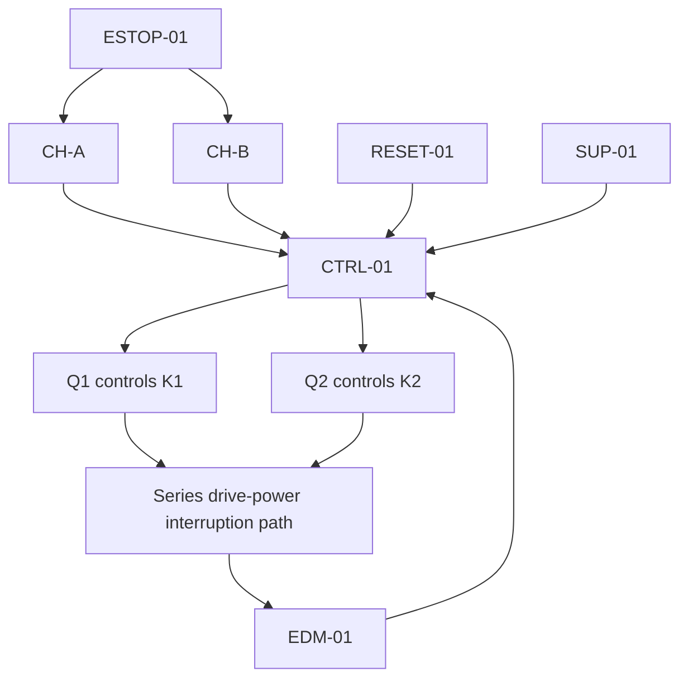
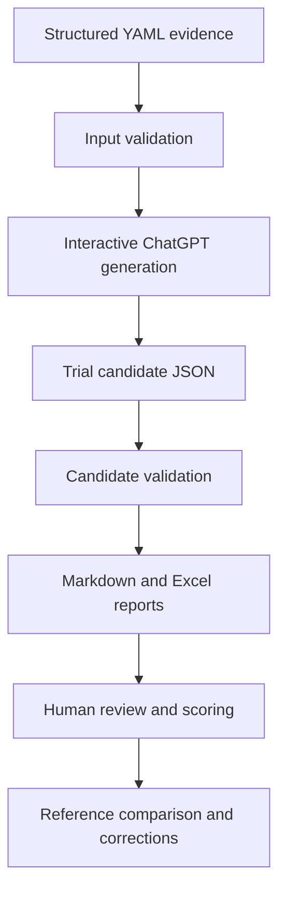

# SafeStop AI-FMEA Pipeline — Project Documentation

## 1. Executive summary

SafeStop AI-FMEA Pipeline is a portfolio-scale, human-in-the-loop workflow for
preliminary Failure Mode and Effects Analysis (FMEA) of a fictional fixed
industrial robot emergency-stop system.

The project stores the system definition, assumptions and draft safety
requirements as structured YAML evidence. ChatGPT is used interactively to
generate candidate failure modes from that evidence. Python validation then
checks the candidate JSON for structure, traceability, duplicates and
prohibited claims. GitHub Actions packages the validated candidates as
Markdown and Excel reports for human assessment.

The AI produces screening candidates only. It does not approve safety, assign
SIL or PL, demonstrate compliance, replace verification evidence or make the
final FMEA decision.

## 2. Problem statement

Preliminary FMEA work can become inconsistent when system information,
assumptions, failure mechanisms and review decisions are stored in unrelated
documents. Free-text AI output can introduce additional problems, including
unsupported architecture, invented diagnostics, duplicate failure modes and
untraceable conclusions.

This project demonstrates a controlled alternative:

- define the analysis evidence before generating candidates;
- restrict AI generation to an explicit system boundary;
- require evidence references and uncertainty fields in every candidate;
- validate the structured output automatically;
- keep engineering judgement and risk scoring with a human reviewer.

## 3. Project objectives

The project is intended to:

1. represent a fictional safety function as structured, version-controlled
   evidence;
2. generate technically plausible preliminary failure-mode candidates for
   human review;
3. trace each candidate to supplied element, assumption and requirement IDs;
4. distinguish local effect, system effect and potential hazardous consequence;
5. identify assumptions and missing information explicitly;
6. validate the output consistently in a GitHub Actions pipeline;
7. produce an editable review workbook with human assessment fields.

The project is not intended to:

- analyze or commission a real machine;
- calculate or claim SIL, PL or standards compliance;
- replace a risk assessment, verified schematic or component documentation;
- use AI output as verification or acceptance evidence;
- allow AI to make the final safety or FMEA decision.

## 4. System definition

### 4.1 Safety function

The modeled safety function is `SF-01`:

> When either emergency-stop input channel changes to the demanded state,
> de-energize Q1 and Q2, open contactors K1 and K2, remove power enabling
> hazardous motion, and prevent reset until the demand is released and
> contactor feedback is healthy.

The initiating event is a person pressing `ESTOP-01`. The modeled safe state
requires K1 and K2 to be de-energized and open, drive power enabling hazardous
motion to be removed, hazardous motion to have ceased, and restart to remain
inhibited.

### 4.2 Analysis boundary

The analysis includes only:

- `ESTOP-01` and its two channels `CH-A` and `CH-B`;
- safety controller `CTRL-01`;
- safety outputs `Q1` and `Q2`, including their field wiring;
- series contactors `K1` and `K2`;
- external device monitoring loop `EDM-01`;
- manual reset `RESET-01`;
- 24 V safety control supply `SUP-01`.

Robot motion-control software, guarding, stored energy, braking, pneumatic
hazards, safety networks, muting, bypass functions, physical commissioning and
component certification are outside the model.

### 4.3 Simplified architecture



The causal analysis depends on assumption `A-006`: K1 and K2 main contacts are
in series, and either contactor opening removes power enabling hazardous motion.

## 5. Evidence model

| Evidence file | Purpose |
| --- | --- |
| `data/system.yaml` | Project, safety function, elements, interfaces, boundary and out-of-scope items |
| `data/assumptions.yaml` | Assumptions, rationale, required validation source and confirmation status |
| `data/requirements.yaml` | Draft safety requirements, linked IDs, verification methods and expected evidence |
| `prompts/fmea_prompt.md` | Evidence-only generation rules, causal method and prohibited claims |
| `schemas/fmea_candidates.schema.json` | Machine-readable JSON output contract |

The reference FMEA is deliberately excluded from the generation evidence. This
separation allows a later human comparison without leaking the expected answers
into the candidate-generation step.

## 6. End-to-end workflow



### 6.1 Step 1 — define evidence

The system, assumptions and requirements are written before candidate
generation. Stable IDs such as `A-006`, `SR-005` and `K1` provide traceability
across files and outputs.

### 6.2 Step 2 — validate source inputs

`src/validate_inputs.py` checks the YAML structure, unique IDs, linked IDs,
allowed statuses and required content. Invalid or inconsistent evidence stops
the workflow before report generation.

### 6.3 Step 3 — generate candidate failure modes

The contents of the three evidence files are supplied to ChatGPT together with
`prompts/fmea_prompt.md`. ChatGPT returns a JSON array with one distinct failure
mechanism per row.

This generation step is currently interactive. The result is transferred into
a versioned trial file such as:

`trials/TRIAL-01/fmea_candidates.json`

### 6.4 Step 4 — validate candidates

`src/validate_candidates.py` validates the typed output contract and performs
semantic checks. The pipeline checks, among other things:

- sequential candidate IDs without gaps;
- valid boundary element IDs;
- valid evidence references;
- required assumptions and missing-information fields;
- allowed confidence and AI screening labels;
- duplicate or near-duplicate failure mechanisms;
- prohibited SIL, PL, certification and compliance claims.

### 6.5 Step 5 — render reports

After validation:

- `src/render_report.py` creates a Markdown review report;
- `src/render_xlsx.py` creates an editable Excel review workbook;
- the candidate JSON and both reports are uploaded as a GitHub Actions artifact.

### 6.6 Step 6 — human review

The human assessor reviews the causal chain and records the disposition,
corrections, notes and any project-defined score category. Severity,
Occurrence and Detectability are intentionally left blank for human input.

## 7. Automation boundary

| Activity | Current implementation |
| --- | --- |
| Store and version evidence | Automatic through Git/GitHub after commit |
| Validate YAML evidence | Automatic |
| Generate FMEA candidates with an LLM | Manual, interactive ChatGPT step |
| Store the candidate trial | Manual human transfer and commit |
| Validate candidate structure and traceability | Automatic |
| Generate Markdown report | Automatic |
| Generate Excel workbook | Automatic |
| Assign S/O/D ratings | Human only |
| Calculate RPN after human ratings | Automatic Excel formula |
| Approve, correct or reject candidates | Human only |

The workflow is therefore an **AI-assisted, human-in-the-loop pipeline**, not a
fully automated AI FMEA generator. Full generation automation would require an
LLM API call from GitHub Actions, additional API error handling and paid API
usage. The current design avoids those costs and retains an explicit human
transfer gate.

## 8. Candidate data contract

Each candidate contains:

| Field | Meaning |
| --- | --- |
| `candidate_id` | Sequential identifier such as `AI-001` |
| `element_id` | Supplied component or interface ID under analysis |
| `failure_mode` | Distinct physical, wiring, control or configuration failure mechanism |
| `local_effect` | Immediate effect at the failed element or interface |
| `system_effect` | Effect on the safety function, redundancy, diagnostics or reset readiness |
| `hazardous_consequence` | Potential consequence after explaining whether the safety function is achieved, degraded, latent or lost |
| `detection_mechanism` | Supplied or proposed way to detect the failure |
| `recommended_action` | Human-review, evidence or test action |
| `evidence_references` | Supplied element, assumption and requirement IDs |
| `confidence` | `High`, `Medium` or `Low` |
| `assumptions` | Necessary unsupported conditions used in the causal chain |
| `missing_information` | Schematics, manuals, configuration or test evidence still needed |
| `ai_classification` | Screening label for human review, not a risk rating |

Allowed AI screening labels are `Safe`, `Degraded`, `Dangerous`,
`Dangerous latent` and `Uncertain`.

## 9. Excel review workbook

The generated `fmea_report.xlsx` contains three sheets.

### 9.1 Summary

The Summary sheet displays:

- trial identifier and total candidate count;
- AI classification counts;
- confidence counts;
- human review disposition counts;
- the required review sequence and disclaimer.

### 9.2 Rating Criteria

This sheet contains an illustrative 1–10 qualitative scale for Severity,
Occurrence and Detectability. It is a portfolio placeholder only and must be
replaced with the organization-approved method before any real use.

Higher Detectability values mean the failure is harder to detect. No RPN
acceptance or pass/fail threshold is defined.

### 9.3 FMEA Candidates

This sheet contains the 29 `TRIAL-01` candidates and editable human-review
columns:

- Severity (`S`), 1–10;
- Occurrence (`O`), 1–10;
- Detectability (`D`), 1–10;
- automatically calculated RPN;
- human disposition;
- score category;
- reviewer corrections and notes.

RPN is calculated only when all three human ratings are present:

`RPN = Severity × Occurrence × Detectability`

RPN is a prioritization aid, not a safety acceptance decision. The AI does not
populate S, O or D.

## 10. Current TRIAL-01 result

`TRIAL-01` contains 29 preliminary candidates.

### AI screening distribution

| Classification | Count |
| --- | ---: |
| Safe | 8 |
| Degraded | 4 |
| Dangerous | 6 |
| Dangerous latent | 6 |
| Uncertain | 5 |

### Confidence distribution

| Confidence | Count |
| --- | ---: |
| High | 12 |
| Medium | 14 |
| Low | 3 |

These counts summarize AI screening output. They are not a risk result or a
human verdict.

## 11. GitHub Actions workflows

### 11.1 Validate safety inputs

`.github/workflows/validate.yml` runs on pushes and pull requests. It installs
the Python dependencies, validates the evidence and schema, runs unit tests,
validates the committed trial and checks report rendering.

### 11.2 Build FMEA report

`.github/workflows/generate-fmea.yml` is started manually with
`workflow_dispatch`:

1. open **Actions → Build FMEA report**;
2. select **Run workflow**;
3. choose `TRIAL-01`;
4. wait for the green successful result;
5. download the `safestop-TRIAL-01` artifact.

The downloaded ZIP contains:

- `fmea_candidates.json`;
- `fmea_report.md`;
- `fmea_report.xlsx`.

No API key is required for the current workflows.

## 12. Local execution

Install dependencies:

```bash
python -m pip install -r requirements.txt
```

Run the checks:

```bash
python src/validate_inputs.py
python -m src.export_schema --check
python -m unittest discover -s tests -v
python -m src.validate_candidates trials/TRIAL-01/fmea_candidates.json
```

Generate the reports:

```bash
python -m src.render_report trials/TRIAL-01/fmea_candidates.json \
  --trial-id TRIAL-01 \
  --output outputs/TRIAL-01/fmea_report.md

python -m src.render_xlsx trials/TRIAL-01/fmea_candidates.json \
  --trial-id TRIAL-01 \
  --output outputs/TRIAL-01/fmea_report.xlsx
```

## 13. Repository structure

```text
.
├── .github/workflows/          GitHub Actions validation and report build
├── data/                       Structured system evidence
├── docs/                       Detailed project documentation
├── prompts/                    Controlled FMEA generation prompt
├── schemas/                    JSON output contract
├── src/                        Validation and report-generation code
├── tests/                      Automated unit tests
├── trials/TRIAL-01/            Versioned candidate trial
├── README.md                   Project overview and quick start
└── requirements.txt            Python dependencies
```

## 14. Human review procedure

For each candidate, the reviewer should:

1. confirm that the failure mechanism is distinct and physically credible;
2. check the local-to-system causal chain against the supplied architecture;
3. verify that evidence references support the statements made;
4. identify unsupported conditions and missing information;
5. accept, correct or reject the candidate for reference comparison;
6. enter S, O and D only using the approved assessment criteria;
7. record corrections and reviewer notes;
8. retain independent verification evidence outside the AI output.

## 15. Limitations

- The modeled system is fictional and simplified.
- Several architecture statements are assumptions awaiting validation.
- Controller internals are treated as a black box.
- No real schematic, component manual, configuration or test trace is supplied.
- The 100 ms and 500 ms values are illustrative, not validated machine limits.
- Candidate generation is interactive rather than API-automated.
- The rating scale is illustrative and has no approved RPN threshold.
- AI screening labels and confidence values are not risk ratings.
- The output cannot support certification, commissioning or a compliance claim.

## 16. Possible future improvements

1. Add controlled API-based candidate generation as an optional paid workflow.
2. Add human-reviewed `TRIAL-02` and `TRIAL-03` for repeatability comparison.
3. Compare candidates against the excluded reference FMEA using recorded human
   dispositions and corrections.
4. Add coverage metrics for reference mechanisms, duplicates and false
   positives.
5. Replace illustrative rating criteria with a defined project method.
6. Add a review-completion check before exporting a final assessed workbook.
7. Add verified schematics, controller configuration and test evidence in a
   future non-fictional implementation.

## 17. Portfolio interpretation

The project demonstrates the combination of:

- functional-safety reasoning and preliminary FMEA;
- evidence-controlled prompt engineering;
- YAML/JSON data modeling and traceability;
- Python validation and report generation;
- GitHub version control and GitHub Actions;
- human-in-the-loop AI governance;
- Excel-based engineering review and formula-driven RPN calculation.

A concise portfolio description is:

> Developed a human-in-the-loop AI-assisted FMEA pipeline for a fictional
> industrial robot emergency-stop system. Structured YAML evidence is used to
> generate traceable preliminary failure-mode candidates in ChatGPT. Python and
> GitHub Actions validate the candidate JSON and automatically create Markdown
> and Excel reports. Severity, Occurrence, Detectability and final dispositions
> remain human-controlled, while RPN is calculated automatically after review.

